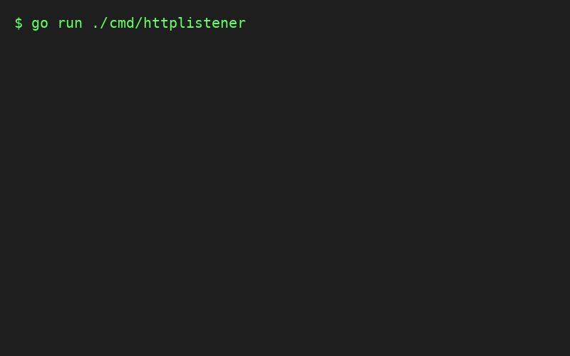

<h1 align="center">httpGo 🚀</h1>

<p align="center">
  
</p>

<p align="center">
  <b>A low-level, high-performance TCP-to-HTTP server built entirely from scratch in Go.</b>
</p>

---

## 🎬 Demo

<p align="center">
  
</p>

---

## 🛠️ Features

* **Custom HTTP Parser**: Zero-dependency parser that reads raw socket bytes directly, completely bypassing Go's built-in `net/http` server implementation.
* **Concurrency**: Spawns independent goroutines to handle multiplexed connections on port `:42069`.
* **Dynamic Memory Buffering**: Intelligently handles variable TCP chunk boundaries and expands buffer size automatically.
* **Advanced Header Management**:
  * Case-insensitive header normalization (e.g., `User-Agent` canonicalized to `user-agent`).
  * Seamless multi-value header merging following RFC 9110 rules.
* **HTTP Proxying**: Fully functioning reverse proxy to forward paths like `/httpbin/*` to external APIs (e.g., `https://httpbin.org`).
* **Chunked Transfer Encoding & Trailers**: Fully supports rendering body data as `Transfer-Encoding: chunked` and sending trailing HTTP headers like `X-Content-SHA256`.
* **Binary File Delivery**: Easily serves rich media, such as high-definition MP4 video files.

---

## 🏗️ Architecture

### The Parser State Machine
To efficiently process incoming network streams, `httpGo` employs a bespoke state machine:

1. **Initialization**: Awaiting the start of an HTTP request line.
2. **Request Line Parsing**: Extracts the `Method`, `RequestTarget`, and `HttpVersion`.
3. **Headers Parsing**: Sequentially digests headers, handling continuations and value normalization.
4. **Body Parsing**: Utilizes `Content-Length` (if available) to pull the payload correctly before passing the generated `*Request` struct up to the application handlers.

### Zero-Copy-Like Byte Shifting
Instead of creating massive allocations per request, the parser begins with an ultra-light **8-byte buffer**. If more bytes arrive before an HTTP boundary (like `\r\n`), it geometrically doubles the size. Once parsed, it *shifts* any remaining raw TCP bytes leftwards to minimize overhead and maximize throughput.

---

## 📂 Project Structure

* **`cmd/httplistener/main.go`**: The entrypoint. Orchestrates route handling, proxy endpoints, binary streaming endpoints, and invokes the custom server.
* **`internal/request/`**: The core state machine and byte management logic for streaming TCP payloads.
* **`internal/headers/`**: Custom HTTP header structures, implementing robust parsing and duplicate header consolidation.
* **`internal/response/`**: Custom Response Writer utilities for safely writing status lines, headers, chunked bodies, and trailers.
* **`internal/server/`**: The TCP listener loop and worker dispatch mechanism.

---

## 🚀 Quick Start

1. Start the HTTP listener server:

```bash
go run cmd/httplistener/main.go
```

The server will automatically bind and listen on port `:42069`.

2. Make standard HTTP requests from any terminal:

```bash
curl -i http://localhost:42069/
```

3. Test out the proxy handler:

```bash
curl -i http://localhost:42069/httpbin/html
```

4. Stream a video file:

```bash
curl -i http://localhost:42069/video -o output.mp4
```

---

## 🧪 Testing

The codebase includes robust, granular unit tests testing the limits of the buffer shifting algorithm, multi-value header edge cases, and unexpected TCP disconnections.

```bash
go test -v ./...
```
